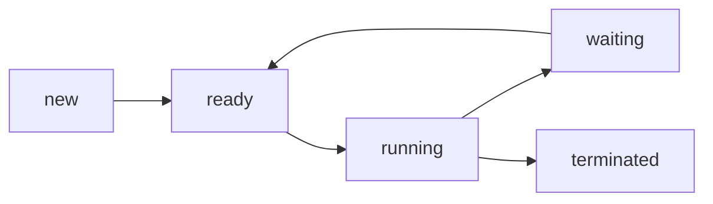
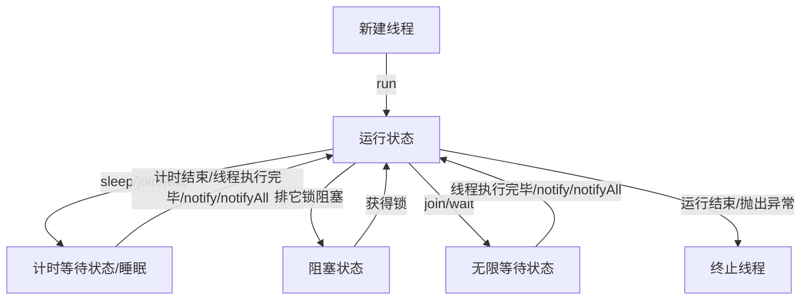

## Java线程的6个状态

### 操作系统线程的状态

### Java线程状态的进入和退出方式

##### NEW

trhead.start()后即创建新线程

##### RUNNABLE

包含了操作系统线程状态的ready和running，线程执行run等方法开始执行时即进入runnable状态

##### BLOCKED

线程等待获取排它锁，当获取到锁时即回复RUNNABLE状态

##### TIMED WAITING

| 进入                     | 退出                                            |
| ------------------------ | ----------------------------------------------- |
| Thread.sleep(long mills) | 计时结束                                        |
| Thread.join(long mills)  | 当前线程挂起，直到计时结束/被调用的线程执行完毕 |
| Object.wait(long mills)  | 计时结束/Object.notify()/Object.notifyAll()     |
| LockSupport.parkUntil()  |                                                 |

##### WAITING

| 进入                          | 退出                                   |
| ----------------------------- | -------------------------------------- |
| Thread.join()或Thread.join(0) | 当前线程挂起，直到被调用的线程执行完毕 |
| Object.wait()或Object.wait(0) | Objetc.notify()/Object.notifyAll()     |
| LockSupport.park()            |                                        |

##### TERMINATED

当线程执行完毕或抛出异常时，便进入terminated状态，线程结束

#### Object常用方法

- `wait(long millers)`：休眠n毫秒
- `wait()`：无限等待
- `notify()`：唤醒等待set中等待时间最长的线程
- `notifyAll()`：唤醒所有等待的线程

#### 线程间通信（等待唤醒机制）

等待唤醒机制就是典型的“消费者-生产者”机制

当多个线程并发执行，使用共享资源时，线程任务不同而需要规律执行，则需要进程间的通信，体现为：

运行状态和为无限等待状态的`切换`：

- 创建2个线程：无限等待和唤醒

- 2个线程的锁对象必须唯一且相同

- 保证两个线程只能有一个执行，要使用同步技术

- 唤醒的线程还要抢到锁对象才能进入运行状态