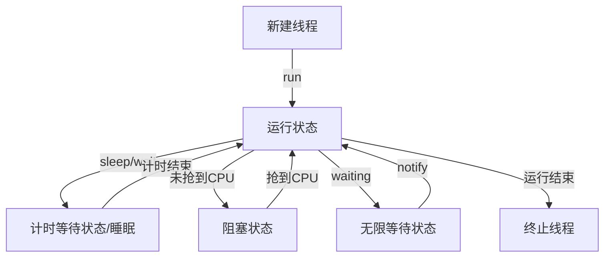

## 线程的6个状态

#### 常用方法

- `wait(long millers)`：休眠n毫秒
- `wait()`：无限等待
- `notify()`：唤醒等待set中等待时间最长的线程
- `notifyAll()`：唤醒所有等待的线程

#### 线程间通信（等待唤醒机制）

等待唤醒机制就是典型的“消费者-生产者”机制

当多个线程并发执行，使用共享资源时，线程任务不同而需要规律执行，则需要进程间的通信，体现为：

运行状态和为无限等待状态的`切换`：

- 创建2个线程：无限等待和唤醒

- 2个线程的锁对象必须唯一且相同

- 保证两个线程只能有一个执行，要使用同步技术

- 唤醒的线程还有抢到锁对象才能进入运行状态