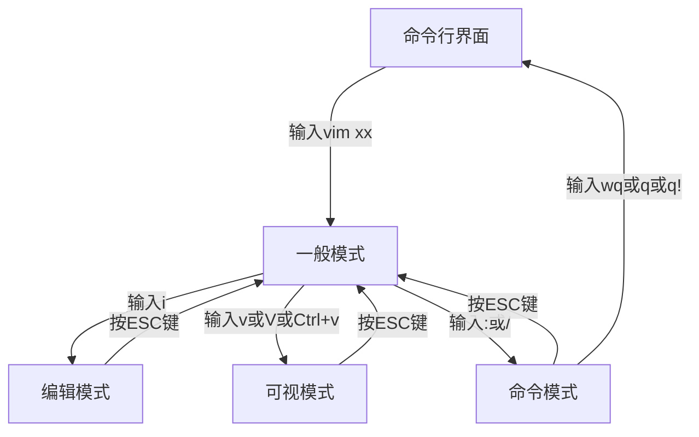

### 一、4个模式
#### 1、一般模式/正常模式

vim打开文件的默认模式，在此模式下，可以移动光标、删除某个字符/某行、复制/粘贴多行

在此模式下进入编辑、可视、命令模式
#### 2、编辑（插入）模式

可以进行文字编辑（输入）
#### 3、可视模式

选中某块区域，进行删除、替换、复制、粘贴、改变大小等操作
- d:删除
- y：复制
- p：粘贴
- r：文本替换
- gu：转换为小写
- gU：转换为大写
- g~：大小写互换

#### 4、命令模式

可以进行保存、搜索、替换、推出，显示行号等操作
三个参数
- wq：表示保存、退出
- q：表示退出但不保存
- q!表示强制退出，修改不会被保存

### 二、常用快捷键

快捷键只能在一般模式下进行

#### 1、拷贝粘贴行

- 拷贝当前行：yy
- 拷贝当前行下面（包含当前行）的n（如5）行：5yy- 粘贴：p

#### 2、删除行
- 删除当前行：dd
- 删除当前行下面（包含当前行）的n（如5）行：5dd

#### 3、撤销输入
处于正常模式下
- 撤销刚才输入的内容：u

#### 4、查找文件中的内容
处于命令模式下
- 查找内容：/xxxx
- 跳转到下一个匹配的内容：n

#### 5、设置/取消文件行号
处于命令模式下
- 设置行号：set nu
- 取消行号：set nonu

#### 6、跳转到文档末始/末端
处于正常模式
- 跳转始端：gg
- 跳转末端：G

#### 7、将光标移动到指定的行
处于命令模式
- 步骤1：开启行数显示set nu
- 步骤2：输入所要跳转的函数(如20)
- 步骤3：按Shift + g