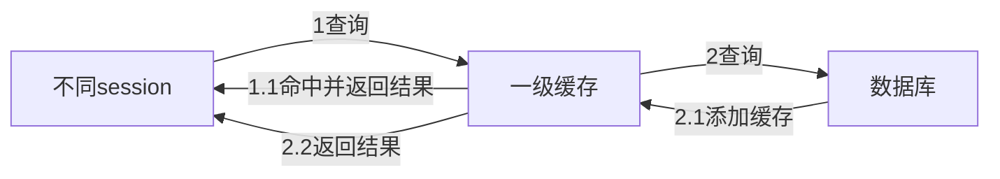
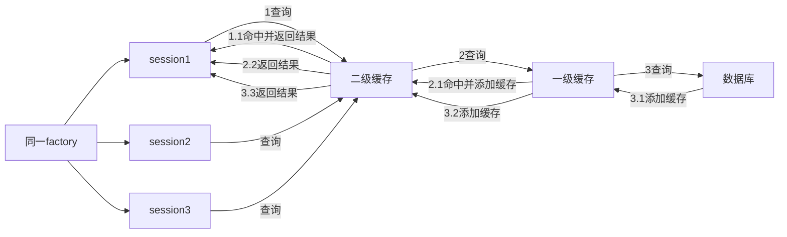

## 缓存的使用

### 一级缓存

MyBatis默认开启一级缓存，即同一个session会优先到一级缓存中查找



### 二级缓存

二级缓存即factory层次下的缓存，即同一个factory构建的不同session优先到二级缓存中查找



需要在MyBatis配置中添加二级缓存的开启配置

```xml
<settings>
	<setting cacheEnabled = "true"></setting>
</settings>
```

#### 1. xml方式开启开启二级缓存

添加<cache/>标签即可使用二级缓存

```xml
<cache
       eviction = "FIFO"
       flushInterval = "6000"
       size = "1024"
       readOnly = "true"/>
```

- cache中包含多个属性，用于控制缓存清除策略、缓存刷新时间、刷新规则等
  - eviction表示缓存清除策略：LRU、FIFO、SOFT、WEAK
  - flushInteval表示缓存刷新间隔时间：默认为是随机刷新
  - size表示缓存对象大小和运行环境中可用的内存资源，默认为1024
  - radOnly表示缓存对象是否为只读，默认为false，当true时查询返回的是同一个对象

#### 2. 注解方式开启二级缓存

在mapper类名前添加@CacheNamespce即可