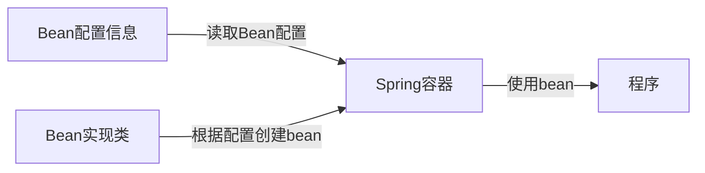
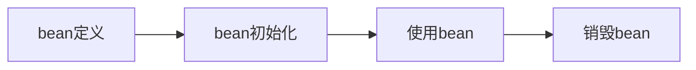

## Bean配置方式

### 基于xml的bean配置

#### 1. bean配置的属性

| 属性           | 说明                           |
| -------------- | ------------------------------ |
| id/name        | bean的唯一标识符               |
| class          | bean对应的实现类，全限定标识符 |
| scope          | bean对象的作用域               |
| autowire       | 自动装配设置                   |
| lazy-init      | 懒加载设置                     |
| init-method    | bean初始化时的回调方法         |
| destroy-method | bean销毁时的回调方法           |

#### 2. bean的作用域

| 作用域         | 说明                                                         |
| -------------- | ------------------------------------------------------------ |
| singleton      | 单例模式，默认值                                             |
| prototype      | 多例模式                                                     |
| request        | 每个HTTP请求都会创建一个新的bean，仅适用于WebAplicationContext环境 |
| sesion         | 同一个HTTP Session（含多个请求）共享一个bean，仅适用于WebAplicationContext环境 |
| global-session | 作用域集群环境的会话范围（全局会话范围），仅适用于WebAplicationContext环境 |

#### 3. bean的生命周期

init-method属性指向的方法会在bean初始化时调用

destroy-method属性指向的方法会在bean销毁时调用

单例对象的生命周期与容器相同

多例对象的的销毁：当没有对象引用时，由JVM的垃圾回收器回收

- 实现在bean初始化前和初始化后的回调方法，进行相应的操作

### 基于注解的bean配置

### 基于Java类的bean配置

