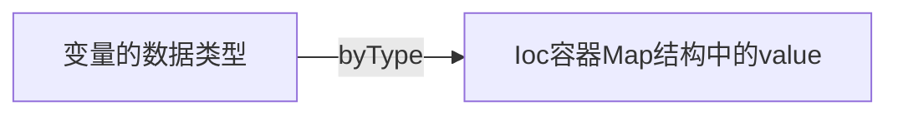
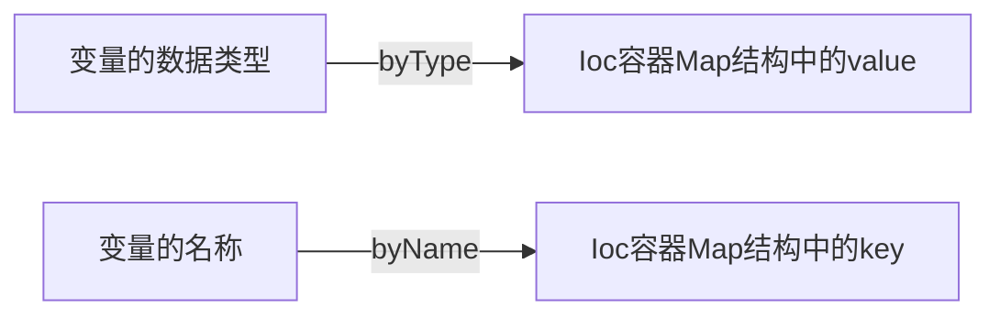

## 基于注解的bean

### 1. 与配置文件相关的注解

使用注解的方式创建bean，需要在配置文件中使用以下配置

````xml
<beans xmlns="http://www.springframework.org/schema/beans"
       xmlns:xsi="http://www.w3.org/2001/XMLSchema-instance"
       xmlns:context="http://www.springframework.org/schema/context"
       xsi:schemaLocation="http://www.springframework.org/schema/beans
        https://www.springframework.org/schema/beans/spring-beans.xsd
        http://www.springframework.org/schema/context
        https://www.springframework.org/schema/context/spring-context.xsd">

    <context:component-scan base-package="com.hong"/>
</beans>
````

### 2. 与创建bean相关的注解

以下四种注解的作用是相同的，其对应的类会自动创建bean并存入spring容器中

@Component(value = "")

- value属性：指定bean的唯一id，若无则bean的名称为类名的小驼峰写法

@Repository(value = "")

- 作用于**持久层**

@Service(value = "")

- 作用于**服务层**

@Controller(value = "")

- 作用于**表现层**

### 3. 与依赖注入相关的注解

#### 在自定义类中使用依赖注入

@Autowired

- 可以放在变量前或setter方法前
- 按照byType模式自动查找bean



@Qualifier(value = "")

- value属性值指向对应的bean的id

- 必须与Autowired注解一起使用，注明该变量装配的bean，防止自动装配混乱

- 使用Qualifier注解后，依赖注入是先按照byType方式自动查找bean，若存在多个同类型bean则按照byName方式查找



@Resource(name= "")

- name属性值对应bean的id

- 与Autowired和Qualifier共同使用的效果相同

@Value(value = ${value名称})

- 用于注入基本数据类型和String

##### 注解依赖注入与xml依赖注入的区别

- 使用注解依赖注入时，setter方法不再必须存在
- 集合类型的数据只能通过xml依赖注入

### 4. 控制bean作用域的注解

@Scope(value = "")

- singleton，单例模式
- prototype，多例模式

### 5. 与bean生命周期相关的注解

以下两个注解基于JSR-250注释，在JDK6-8中是标准包，在JDK11已经被移除

@PostConstruct

- 指定bean初始化时的回调方法，在特定方法前使用

@PreDestroy

- 指定bean销毁时的回调方法，在特定方法前使用

