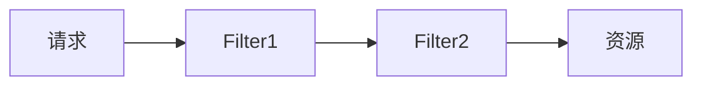

## Filter概述

web中的过滤器：访问服务器时，过滤器可以把请求拦截下来，完成一些特殊、普遍性的操作

实际应用：

- 登陆验证
- 统一编码处理
- 敏感字符处理

### 实现步骤

1. 定义一个类，实现接口Filter
2. 覆写方法
3. 配置拦截路径
   - web.xml配置
   - 注解配置：@WebFIlter(路径)
4. 实现拦截逻辑

### 拦截方式

- 通过注解的dispatcher参数设置
- 通过web.xml的<dispatcher>标签设置

REQUEST：默认方式，拦截来自客户端的直接请求

FORWARD：拦截request对象转发的请求

INCLUDE：

ERROR：当请求是由于异常处理引发时，则拦截

### 多个FIlter的拦截顺序

- 通过注解配置拦截器时，根据类名称的比较进行拦截
- 通过web.sml配置拦截器时，根据定义顺序拦截

### 多个Filter的执行顺序

按照顺序递归执行

