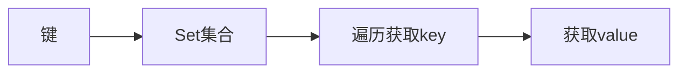
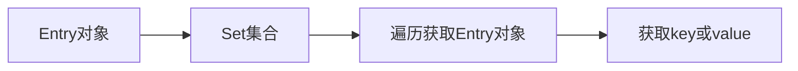

## Map集合

### 1、常用方法

- `public V put(K key, V value)`

添加键值到Map集合中，若无重复键值，则返回null；否则返回返回被替换的value值

- `public V get(K key)`

返回集合中key对应的的value值

- `public V remove(K key)`

移除集合中某键值，返回被移除的value值

- `public boolean containsKey(K key)`

判断集合中是否含有某键值，有返回true，否则返回false

### 2、Map集合遍历的方式

#### 通过key找value的方式遍历

- 使用Map集合的keySet()方法，将集合中的key存储到Set集合中
- 遍历Set集合，通过get(key)方法，找到value



```Java
Map<String, Integer> map = new Map<>();
Set<String> keys = map.keySet();
Iterator it = keys.iterator();
while(it.hasNext()){
	String key = it.next();
	Integer value = map.get(key);
}
```


#### 通过键值对对象Entry遍历

- Map集合创建时，会在内部创建一个Entry对象，记录键与值得映射关系
- 使用Map集合的entrySet()方法，将集合中的Entry对象存储到Set集合中
- 遍历Set集合，获取每个Entry对象，再通过Entry对象得getKey()方法获取键、getValue()方法获取值



```Java
Map<String, Integer> map = new Map<>();
Set<Map.Entry<String, Integer>> set = map.entrySet();
Iterator it = set.iterator();
while(it.hasNext()){
	Map.Entry<String, Integer> entry = it.next();
	String key = entry.getKey();
	Integer value = entry.getValue();
}
```


### HashMap实现类

- 底层是哈希表，查询快
- 无序，，即取得顺序不一定时存的顺序
- 键不可重复，值可以重复，自定义类型要重写键的hashCode()方法和equals()方法

### LinkedHashMap

- 是HashMap的子类
- 底层时哈希表+链表的结构，
- 有序，存取顺序相同
- 键不可重复，值可以重复，自定义类型要重写键的hashCode()方法和equals()方法
