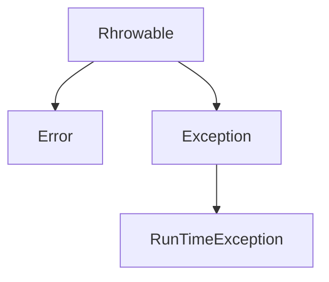
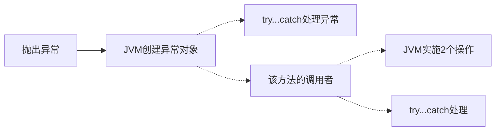

## 异常体系

### 1、异常分类

Throwable：所有错误或异常的父类

- Error：严重错误，无法处理，必须修改源码，且尽量避免

- Exception：编译期（打代码时）异常，可通过修改代码让程序可以继续运行，程度较轻
  - RunTimeException：运行期异常

### 2、异常分析和处理

产生异常的过程中，会经历如下流程：

- JVM 会根据异常产生的原因`创建一个异常对象`，这个异常对象包含了异常产生的内容、原因、位置
- 若`没有异常处理机制`（try..catch），JVM则将异常对象抛给方法的调用者（如main方法）处理
- 方法的调用者（如main方法）若`没有异常处理机制`，则将异常对象抛给JVM处理
- JVM最终做2个操作：在控制台`打印异常对象`、`中断程序`

异常处理选择：

- Exception：必须处理，要么throws交给方法的调用者处理、要么try..catch..finally
- RunTimeException：可以不处理，抛出交给JVM处理，即中断程序

## 错误种类

#### 1、用户输入错误

#### 2、设备错误

#### 3、物理限制

#### 4、代码错误