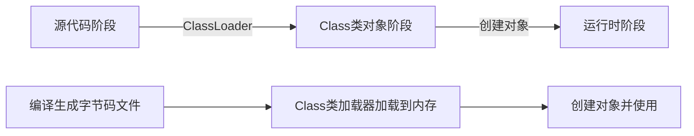

## 反射概述

反射：将类的各个组成部分封装成其他对象

好处：可以在程序运行过程中操作对应的对象、可以对程序解耦

Java类从源代码到内存对象的三个阶段：



由源代码编译生成的Class字节码文件，经过类加载器ClassLoader类加载到内存中，将类的各个部分封装到Class对象中，最后创建类对象并使用

### 获取字节码Class对象的三种方法

同一个字节码文件只会被类加载器加载一次，因此以下三种方法获取的Class对象是同一个

1. Class.forName("全限定类名")

   将字节码文件加载进内存，返回Class类对象

2. 类名.class

   通过类的class属性获取Class对象

3. 对象.getClass()

   通过Object类的getClass()方法获取Class对象

| 类的组成部分 | Class类对象        | 常用方法    |
| :----------: | ------------------ | ----------- |
|   成员变量   | Field[] fields     | 读/写...    |
|   构造方法   | Constructor[] cons | 创建对象... |
|   成员方法   | Method[] methods   | 使用方法... |
|     ...      | ...                | ...         |

### Class对象的获取功能

#### 1. 获取成员变量

- Field[] getFields() 获取所有public成员变量
- Field getField(String name) 获取特定的public成员变量
- Field[] getDeclaredFields() 获取所有成员变量
- Field getDeclaredField(String name) 获取特定的成员变量

public 成员变量的读取

- field.get(特定对象)

```java
Class studentClass = Class.forName(全限定类名);
Field field = studentClass.getField("name");
Student student = new Student();
String name = field.get(student);
```

public 成员变量的修改

- field.set(特定对象, 修改值)

```java
Class studentClass = Class.forName(全限定类名);
Field field = studentClass.getField("name");
Student student = new Student();
String name = field.set(student, "小红");
```

private 成员变量的读取

- declaredField.setAccessible(true) 忽略访问权限修饰符的检查、暴力反射
- declaredField.get(类对象)

```java
Class studentClass = Class.forName(全限定类名);
Field field = studentClass.getDeclaredField("name");
Student student = new Student();
field.setAccessible(true);
String name = field.get(student);
```

private 成员变量的修改

- declaredField.setAccessible(true) 忽略访问权限修饰符的检查、暴力反射
- declaredField.set(类对象, 特定值)

```java
Class studentClass = Class.forName(全限定类名);
Field field = studentClass.getDeclaredField("name");
Student student = new Student();
field.setAccessible(true);
String name = field.set(student, "小红");
```

#### 2. 获取构造方法

- Constructor<?> getConstructor() 获取无参构造方法
- Constructor<T> getConstructor(类.class...parametersTypes) 获取带参构造方法
- Constructor<?> getDeclaredConstructor() 获取private构造方法
- Constructor<T> getDeclaredConstructor(类.class...parametersTypes) 获取private带参构造方法

无参构造方法创建对象

```java
Class studentClass = Class.forName(全限定类名);
Constructor constructor = studentClass.getConstructor();
Student student = constructor.newInstance()
// 或者直接使用类的Class对象创建
// Student student = studentClass.newInstance()
```

带参构造方法创建对象

- constructor.newInstance(参数值...)

```java
Class studentClass = Class.forName(全限定类名);
Constructor constructor = studentClass.getConstructor(String.class, Integer.class);
Student student = constructor.newInstance("小红", 15);
```

#### 3. 获取成员方法

- Method[] getMethods() 获取所有的public方法
- Method getMethod(String name, 类.class...parametersypes) 获取特定带参的publ ic方法
- Method[] getDeclaredMethods() 获取所有的方法
- Method getDeclaredMethod(String name, 类.class...parametersypes) 获取特定带参方法

执行无参成员方法

```java
Class studentClass = Class.forName(全限定类名);
Method method = studentClass.getMethod("getName");
Student student = new Student();
method.invoke(student);
```

执行带参成员方法

```java
Class studentClass = Class.forName(全限定类名);
Method method = studentClass.getMethod("setName", String.class);
Student student = new Student();
method.invoke(student, "小红");
```

#### 4. 获取类名

- String getName()

