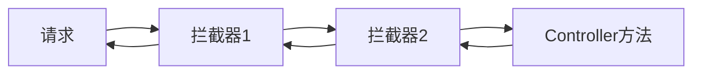

## 拦截器

过滤器是Servlet中一部分，当url-pattern配置了/*后，可以对所有要访问的资源拦截

拦截器是MVC特有的，只会拦截访问的控制方法，其他静态资源如jsp、js、image等不拦截

###  编写拦截器类，实现HandlerInterceptor接口

- preHandler方法：预处理，Controller执行前
  - 返回true，放行去执行下一个拦截器，没有下一个拦截器则执行Controller方法
  - 返回false，拦截该请求
- postHandler方法：后处理，Controller执行后
- afterCompletion方法：最后执行，一般用于释放资源

### 配置拦截器

拦截器的执行顺序即其定义的顺序




- <interceptor>
  - <mvc:ineterceptor>
    - <mvc:mapping>：设置拦截的方法，path表示所拦截的路径（相对路径）
    - <mvc:exclude-mappin>：设置不拦截的方法
    - <bean class>：设置拦截器对象

```xml
<!-先执行拦截器1后执行2--->
<mvc:interceptorts>
    <!--拦截器1，拦截home路径的请求-->
	<interceptor>
    	<mvc:ineterceptor>
        	<mvc:mapping path="/home"></mvc:mapping>
            <mvc:exclude-mapping path=""></mvc:exclude-mapping>
            <bean class="..."></bean>
        </mvc:ineterceptor>
    </interceptor>
    <!--拦截器2，拦截所有路径的请求-->
    <interceptor>
    	<mvc:ineterceptor>
        	<mvc:mapping path="/*"></mvc:mapping>
            <mvc:exclude-mapping path=""></mvc:exclude-mapping>
            <bean class="..."></bean>
        </mvc:ineterceptor>
    </interceptor>
</mvc:interceptorts>
```

